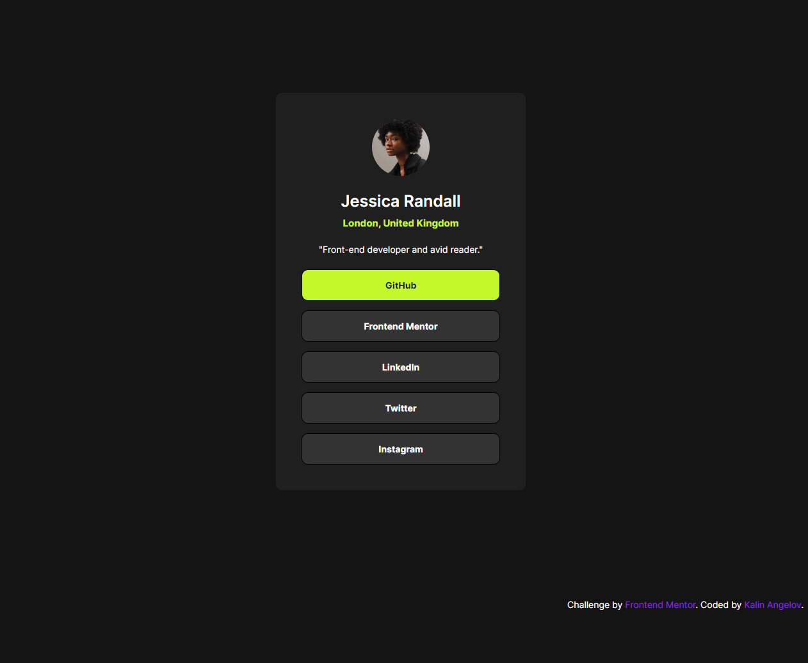

# Frontend Mentor - Social links profile solution

This is a solution to the [Social links profile challenge on Frontend Mentor](https://www.frontendmentor.io/challenges/social-links-profile-UG32l9m6dQ). Frontend Mentor challenges help you improve your coding skills by building realistic projects. 

## Table of contents

- [Overview](#overview)
  - [The challenge](#the-challenge)
  - [Screenshot](#screenshot)
  - [Links](#links)
- [My process](#my-process)
  - [Built with](#built-with)
  - [What I learned](#what-i-learned)
  - [Useful resources](#useful-resources)
- [Author](#author)

## Overview

### The challenge

Users should be able to:

- See hover and focus states for all interactive elements on the page

### Screenshot

### Links

- Live Site URL: [Add live site URL here](https://fm-social-links-profile-jade.vercel.app/)

## My process

### Built with

- Semantic HTML5 markup
- Sass
- Flexbox
- Mobile-first workflow

### What I learned

In this exercise i try using `Sass` for the first time, and in the process of styling the challenge i manage to learn how to use `Sass: Variables`, `Sass: Nesting`, `@mixin` and `@include`.

### Useful resources

- [Sass Documentation](https://sass-lang.com/) 
- [Coder Coder Sass Tutorial](https://www.youtube.com/watch?v=jfMHA8SqUL4&t=419s&ab_channel=CoderCoder) 

## Author

- Frontend Mentor - [@kalin-angelov](https://www.frontendmentor.io/profile/kalin-angelov)